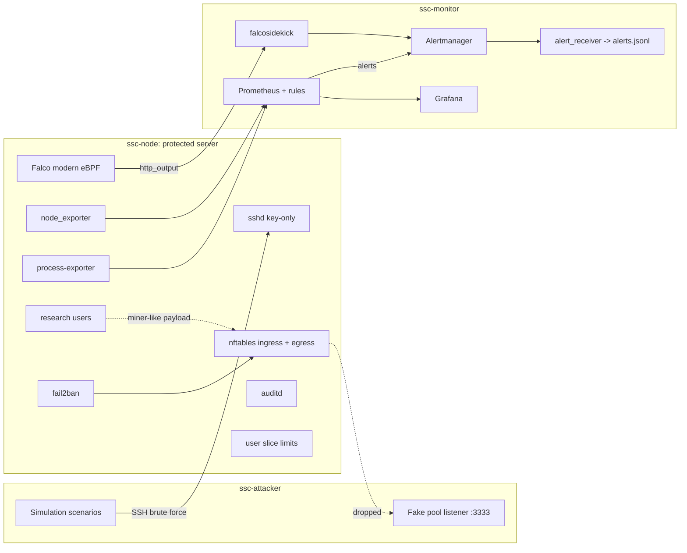

# Architecture

## Components and data flow

## Defense layers

| Layer | Controls | Speed |
|---|---|---|
| Prevent entry | Key-only SSH, AllowGroups, nftables ingress, fail2ban, patching | immediate |
| Prevent execution | noexec on /tmp and /dev/shm | immediate |
| Prevent profit | Egress drop to stratum ports | immediate |
| Limit damage | Per-user CPU, memory, task caps | immediate |
| Detect fast | Falco runtime rules | seconds |
| Detect by behavior | Prometheus per-process CPU alerts | minutes (bounded by scrape interval + `for:`) |
| Record | auditd, journald, nftables logs | for investigation |
| Respond | Runbook | human |

The layers overlap on purpose. A miner that avoids /tmp still hits the CPU cap, the egress block, and the per-process alert. A miner that throttles itself to stay under the CPU threshold still needs a pool connection.

## Why the monitor is a separate VM

If monitoring runs on the node, anyone with root on the node can stop it and the silence looks like "all clear". A separate monitor turns that silence into an `SSCExporterDown` alert. On DASH this maps to a small admin VM or an existing campus monitoring host.

## Detection timing

Alert receive time in `alerts.jsonl` is the single clock for "time to detect". All VMs sync time with chrony. `measure.py` reports time to detect as `first_matching_alert.received_at - scenario.started_at`.

Prometheus latency is roughly scrape interval + rule evaluation interval + the rule's `for:` duration + Alertmanager `group_wait`. Lab defaults are chosen for fast feedback. Production values for DASH should be longer to cut false positives, and that tradeoff is documented in `docs/adr/0006-alert-thresholds.md`.

## Configuration surface (what DASH would change)

All in `inventory/group_vars/`:
- `firewall_admin_cidrs`: who may SSH in (campus ranges or VPN)
- `users_research`: list of users and public keys
- `resource_limits_cpu_quota`, `resource_limits_memory_max`, `resource_limits_tasks_max`
- `detection_process_allowlist_regex`: expected heavy processes (python, jupyter, etc.)
- `detection_cpu_threshold`, `detection_cpu_for`
- `firewall_egress_mode`, `firewall_mining_ports`
- `gpu_enabled`
